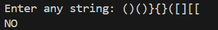
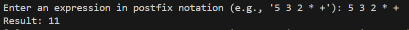
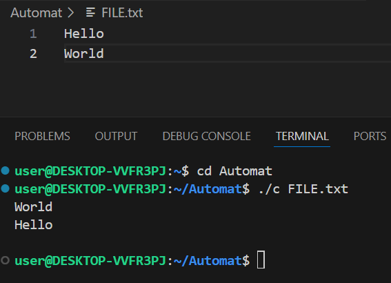
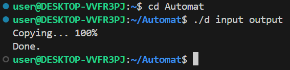

# Задания для сдачи программирования автоматом.
# Работал:Шлендов М.А. 1-й курс. ИВТ-2.
## Задача 1.
Проверка сбалансированности скобок в выражении. Напишите программу для проверки корректности расстановки круглых, фигурных и квадратных скобок в заданной строке.
• Вход. Строка с выражением, содержащим скобки (может включать и другие символы).
• Выход. Вывести YES, если все типы скобок в строке корректно сбалансированы, или NO – если допущена ошибка в порядке скобок.
• Требования. Для проверки использовать стек. Алгоритм должен учитывать соответствие типов скобок (например, [ соответствует ]) и их порядок вложенности. Программа игнорирует несвязанные символы и анализирует только скобки. При обнаружении несбалансированной скобочной структуры обработать ситуацию и вывести NO. Использование стека должно быть реализовано вручную (например, через массив или связный список), без использования сторонних коллекций.

### Мат. модель:
Отсутствует.
### Список идентификаторов:
|Имя|Тип|Смысл|
|---|---|---|
|ParenType|enum|Перечисление, определяющее типы скобок (Parenthesis, SquareBr, CurlyBr)|
|Parenthesis|enum value|Круглые скобки ( |
|SquareBr|enum value|Квадратные скобки [ |
|CurlyBr|enum value|Фигурные скобки { |
|Stack|struct|Структура, реализующая стек (LIFO)|
|items|ParenType*|Массив для хранения элементов стека|
|capacity|size_t|Вместимость стека (максимальное количество элементов)|
|size|size_t|Текущее количество элементов в стеке|
|str|const char*|Входная строка для проверки баланса скобок|
|stack|Stack|Локальная переменная стека в функции balance_parentheses|
|balanced|bool|Флаг, указывающий на сбалансированность скобок|
|paren_type|ParenType|Временная переменная для хранения типа извлеченной скобки|
|result|bool|Результат проверки баланса скобок|

### Код:
```c
#include <stdio.h>
#include <stdlib.h>
#include <stdbool.h>

// Перечисление со всеми видами скобок, которые нужно проверять
typedef enum {
    Parenthesis = 0,  // Круглые скобки '('
    SquareBr,         // Квадратные скобки '['
    CurlyBr,          // Фигурные скобки '{'
} ParenType;
// Структура данных Стек (LIFO - Last In First Out)
typedef struct {
    ParenType* items;   // Массив для хранения элементов стека
    size_t capacity;    // Вместимость стека
    size_t size;        // Текущее количество элементов в стеке
} Stack;
// Функция для создания стека с начальной емкостью 10 элементов
Stack stack_create() {
    Stack stack = {0};
    stack.items = (ParenType*)malloc(10 * sizeof(ParenType));  // Явное приведение типа
    stack.capacity = 10;
    stack.size = 0;
    return stack;
}
// Функция для добавления элемента в стек
void stack_push(Stack* stack, ParenType item) {
    if (stack->size >= stack->capacity) {
        stack->capacity *= 2;
        stack->items = (ParenType*)realloc(stack->items, stack->capacity * sizeof(ParenType));  // Явное приведение
    }
    stack->items[stack->size++] = item;
}

// Функция для извлечения элемента из стека
ParenType stack_pop(Stack* stack) {
    return stack->items[--stack->size];  // Уменьшаем размер и возвращаем последний элемент
}

// Функция для проверки, пуст ли стек
bool stack_is_empty(Stack* stack) {
    return stack->size == 0;  // Стек пуст, если размер равен 0
}

// Функция для освобождения памяти, выделенной под стек
void stack_free(Stack* stack) {
    free(stack->items);       // Освобождаем массив элементов
    stack->items = NULL;      // Обнуляем указатель
    stack->capacity = 0;      // Сбрасываем емкость
    stack->size = 0;          // Сбрасываем размер
}

// Основная функция для проверки сбалансированности скобок
bool balance_parentheses(const char* str) 
{
    Stack stack = stack_create();  // Создаем стек
    bool balanced = true;          // Флаг сбалансированности
    // Проходим по каждому символу строки
    for (; *str != '\0' && balanced; ++str) 
    {
        switch (*str) 
        {
            // Для каждой открывающей скобки добавляем соответствующий тип в стек
            case '(': stack_push(&stack, Parenthesis); break;
            case '[': stack_push(&stack, SquareBr); break;
            case '{': stack_push(&stack, CurlyBr); break;
            // Для закрывающих скобок проверяем соответствие с последней открывающей
            case ')': 
                if (stack_is_empty(&stack)) 
                {
                    balanced = false;  // Если стек пуст - несбалансировано
                } 
                else 
                {
                    ParenType paren_type = stack_pop(&stack);
                    if (paren_type != Parenthesis) 
                    {
                        balanced = false;  // Типы скобок не совпадают
                    }
                }
                break;
            case ']': 
                if (stack_is_empty(&stack)) 
                {
                    balanced = false;
                } 
                else 
                {
                    ParenType paren_type = stack_pop(&stack);
                    if (paren_type != SquareBr) 
                    {
                        balanced = false;
                    }
                }
                break;
            case '}': 
                if (stack_is_empty(&stack)) 
                {
                    balanced = false;
                } 
                else 
                {
                    ParenType paren_type = stack_pop(&stack);
                    if (paren_type != CurlyBr) 
                    {
                        balanced = false;
                    }
                }
                break;
        }
    }
    // После обработки всей строки проверяем, что стек пуст (все скобки закрыты)
    balanced = balanced && stack_is_empty(&stack);
    stack_free(&stack);  // Освобождаем память
    return balanced;     // Возвращаем результат проверки
}

int main() 
{
    char str[255];  // Буфер для ввода строки
    printf("Enter any string: ");
    fgets(str, sizeof(str), stdin);  // Читаем строку от пользователя
    // Проверяем баланс скобок и выводим результат
    bool result = balance_parentheses(str);
    printf("%s\n", result ? "YES" : "NO");
    return 0;
}
```
### Результат:


В ситуациях, когда у всех скобок есть закрывающая пара, алгоритм запускается по новой.

## Задача 2.
Вычисление выражения в постфиксной нотации. Напишите программу, вычисляющую значение арифметического выражения, заданного в обратной польской (постфиксной) записи.
• Вход. Арифметическое выражение в постфиксной форме, где операнды (целые числа) и операции +, -, *, / разделены пробелами. Например: 5 3 2 * +.
• Выход. Единственное число – результат вычисления выражения.
• Требования. Использовать стек для вычисления значения. По мере чтения токенов из выражения программа кладёт числа в стек, а при встрече оператора – извлекает необходимые операнды и помещает обратно результат операции. Предусмотреть поддержку основных бинарных операций +, -, *, / (целочисленное деление). После обработки всего выражения в стеке должен остаться ровно один результат. Если выражение некорректно (например, недостаточно операндов для какой-то операции или в конце в стеке больше одного значения), программа должна выводить сообщение об ошибке.
### Мат. модель:
Отсутствует конкретная.
### Список идентификаторов:
|Имя|Тип|Смысл|
|---|---|---|
|Stack|struct|Структура, представляющая стек для хранения чисел типа long.|
|items|long*|Указатель на динамический массив элементов стека.|
|capacity|size_t	Максимальное количество элементов, которое может хранить стек.|
|size|size_t|Текущее количество элементов в стеке.|
|str|char[256]|Буфер для ввода выражения пользователем.|
|token|char*|Указатель на текущий токен (число или оператор) при разборе строки.|
|error|bool|Флаг ошибки, указывает на наличие ошибки в вычислениях.|
|a|long|Временные переменные для хранения операндов при вычислениях.|
|b|long|Временные переменные для хранения операндов при вычислениях.|
|result|long|Переменная для хранения результата операции.|
|p|char*|Временный указатель для проверки, является ли токен числом.|
|is_number|bool|Флаг, указывающий, является ли токен числом.|
|number|long|Переменная для хранения преобразованного числа из строки.|

### Код:
```c
#include <stdio.h>
#include <stdlib.h>
#include <string.h>
#include <ctype.h>
#include <stdbool.h>

// Структура, представляющая стек для хранения чисел типа long
typedef struct {
    long* items;      // Указатель на динамический массив элементов стека
    size_t capacity;  // Максимальное количество элементов, которое может хранить стек
    size_t size;      // Текущее количество элементов в стеке
} Stack;

/**
 * Создает и инициализирует новый стек
 * @return Возвращает инициализированную структуру стека
 */
Stack stack_create() {
    Stack stack;
    // Выделяем память под начальный буфер из 10 элементов
    stack.items = (long*)malloc(10 * sizeof(long));
    if (!stack.items) {  // Проверка успешности выделения памяти
        fprintf(stderr, "Memory allocation failed\n");
        exit(EXIT_FAILURE);
    }
    stack.capacity = 10;  
    stack.size = 0;       
    return stack;
}

/**
 * Добавляет элемент в стек
 * @param stack Указатель на структуру стека
 * @param item  Элемент для добавления
 */
void stack_push(Stack* stack, long item) 
{
    // Если стек заполнен, увеличиваем его емкость
    if (stack->size >= stack->capacity) 
    {
        stack->capacity *= 2; 
        // Перевыделяем память с новым размером
        long* new_items = (long*)realloc(stack->items, stack->capacity * sizeof(long));
        if (!new_items) // Проверка успешности перевыделения памяти
        {  
            fprintf(stderr, "Memory reallocation failed\n");
            free(stack->items);  // Освобождаем старую память
            exit(EXIT_FAILURE);
        }
        stack->items = new_items;
    }
    // Добавляем элемент и увеличиваем счетчик
    stack->items[stack->size++] = item;
}

/**
 * Извлекает и возвращает верхний элемент стека
 * @param stack Указатель на структуру стека
 * @return Извлеченный элемент
 */
long stack_pop(Stack* stack) {
    if (stack->size == 0) {  // Проверка на пустоту стека
        fprintf(stderr, "Stack underflow\n");
        exit(EXIT_FAILURE);
    }
    return stack->items[--stack->size];  // Уменьшаем счетчик и возвращаем элемент
}

/**
 * Освобождает память, занятую стеком
 * @param stack Указатель на структуру стека
 */
void stack_free(Stack* stack) {
    free(stack->items);      // Освобождаем массив элементов
    stack->items = NULL;     // Обнуляем указатель
    stack->capacity = 0;     // Сбрасываем емкость
    stack->size = 0;         // Сбрасываем счетчик
}

/**
 * Проверяет, является ли строка оператором
 * @param token Строка для проверки
 * @return true если это оператор (+, -, *, /), иначе false
 */
bool is_operator(const char* token) {
    // Оператор должен быть длиной 1 символ и содержать один из +-*/
    return strlen(token) == 1 && strchr("+-*/", token[0]) != NULL;
}

int main() 
{
    char str[256];  // Буфер для ввода выражения
    
    // Запрашиваем ввод выражения у пользователя
    printf("Enter an expression in postfix notation (e.g., '5 3 2 * +'): ");
    if (!fgets(str, sizeof(str), stdin)) // Чтение строки с проверкой
    {  
        fprintf(stderr, "Error reading input\n");
        return EXIT_FAILURE;
    }
    
    // Удаляем символ новой строки, если он есть
    str[strcspn(str, "\n")] = '\0';
    
    // Инициализируем стек для вычислений
    Stack stack = stack_create();
    char* token = strtok(str, " ");  // Первый токен (разделитель - пробел)
    bool error = false;              // Флаг ошибки
    
    // Обрабатываем каждый токен в строке
    while (token != NULL && !error) 
    {
        if (is_operator(token))  // Если токен - оператор
        { 
            // Для оператора нужно минимум 2 числа в стеке
            if (stack.size < 2) 
            {
                fprintf(stderr, "Error: not enough operands for operator '%s'\n", token);
                error = true;
                break;
            }
            
            // Извлекаем два верхних числа (порядок важен!)
            long b = stack_pop(&stack);
            long a = stack_pop(&stack);
            long result;
            
            // Выполняем соответствующую операцию
            switch (token[0]) 
            {
                case '+': result = a + b; break;
                case '-': result = a - b; break;
                case '*': result = a * b; break;
                case '/':
                    if (b == 0) // Проверка деления на ноль
                    {  
                        fprintf(stderr, "Error: division by zero\n");
                        error = true;
                        continue;  // Пропускаем добавление результата
                    }
                    result = a / b;  // Целочисленное деление
                    break;
            }
            
            // Помещаем результат обратно в стек
            stack_push(&stack, result);
        } 
        else // Если токен не оператор, проверяем, является ли он числом
        {  
            bool is_number = true;
            char* p = token;
            
            // Пропускаем знак числа, если он есть
            if (*p == '-' || *p == '+') p++;
            
            // Проверяем, что остальные символы - цифры
            while (*p) 
            {
                if (!isdigit(*p)) 
                {
                    is_number = false;
                    break;
                }
                p++;
            }
            
            if (is_number) 
            {
                // Преобразуем строку в число и добавляем в стек
                long number = atol(token);
                stack_push(&stack, number);
            } 
            else 
            {
                fprintf(stderr, "Error: invalid token '%s'\n", token);
                error = true;
            }
        }
        
        // Получаем следующий токен
        token = strtok(NULL, " ");
    }
    
    // Проверяем результат вычислений
    if (!error) 
    {
        if (stack.size == 1) 
        {
            // В стеке ровно один элемент - это результат
            printf("Result: %ld\n", stack_pop(&stack));
        } else if (stack.size > 1) 
        {
            // В стеке остались числа - не хватило операторов
            fprintf(stderr, "Error: too many operands left in stack\n");
            error = true;
        } else 
        {
            // Стек пуст - не было чисел или операторов
            fprintf(stderr, "Error: no result in stack\n");
            error = true;
        }
    }
    
    // Освобождаем ресурсы
    stack_free(&stack);
    
    // Возвращаем код успеха или ошибки
    return error ? EXIT_FAILURE : EXIT_SUCCESS;
}

```
### Результат:


## Задача 8.
Реверс строк файла. Напишите программу, которая считывает текстовый файл и выводит его строки в обратном порядке.
• Вход. Имя текстового файла задаётся в командной строке.
• Выход. Все строки исходного файла, выведенные в обратном порядке. Каждая строка исходного файла становится отдельной строкой вывода, но порядок строк обращается (последняя строка входного файла становится первой строкой вывода и т.д.).
• Требования. Считать все строки файла в память, сохраняя их в списке (например, в массиве указателей на строки, размер которого увеличивается по мере необходимости). После чтения файла программа не производит дополнительных операций ввода-вывода, а просто выводит ранее сохранённые строки в обратном порядке. Желательно учитывать объём файла: для очень больших файлов можно рассмотреть чтение построчно с записью на диск, однако минимальное решение – считывание целиком – допустимо, если объём файла помещается в оперативную память. Не забыть освободить выделенную память для хранения строк после формирования вывода.
### Мат. модель:
Отсутствует.
### Список идентификаторов:
|Имя|Тип|Смысл|
|---|---|---|
|line|char*|Указатель на строку, в которую считывается содержимое файла|
|line_cap|size_t|Емкость (размер выделенной памяти) для строки line|
|file|FILE*|Указатель на файл, из которого происходит чтение|
|buffer|char[128]|Буфер для временного хранения фрагментов строки при чтении из файла|
|line_len|size_t|Текущая длина строки line|
|buf_len|size_t|Длина строки в буфере buffer|
|bytes_to_copy|size_t|Количество байт, которые нужно скопировать из буфера в строку|
|argc|int|Количество аргументов командной строки|
|argv|char**|Массив аргументов командной строки|
|f|FILE*|Указатель на открытый файл|
|lines_count|size_t|Количество прочитанных строк в массиве lines|
|lines_cap|size_t|Емкость (размер выделенной памяти) для массива lines|
|lines|char**|Массив строк, считанных из файла|
|l|char*|Временная строка для копирования содержимого line перед добавлением в lines|
|i|size_t|Счетчик для итерации по массиву строк при выводе|
### Код:
```c
#include <stdio.h>
#include <stdlib.h>
#include <string.h>

// Функция для чтения строк из файла
long long get_line(char** line, size_t* line_cap, FILE* file) 
{
    // Буффер в который будут читаться куски файла
    char buffer[128];
    // Если указатель на строку равен NULL или емкость строки равна нулю, то
    // выделяем память под считанную строку размером буффера
    // и устанавливаем емкость
    if (*line == NULL || *line_cap == 0) 
    {
        *line_cap = sizeof(buffer);
        *line = (char*)malloc(*line_cap);
    }

    // Общий размер считанной конечной строки
    size_t line_len = 0;
    // Читаем куски файла размером буффера, пока не дойдем до конца файла
    while (fgets(buffer, sizeof(buffer), file)) 
    {
        // Получаем длину строки в буффере
        size_t buf_len = strlen(buffer);

        // Если общая длина считанной строки + длина строки в буффере больше или равна емкости конечной строки, то
        // увеличиваем емкость в 2 раза и перевыделяем память под конечную строку
        if (line_len + buf_len >= *line_cap) 
        {
            *line_cap *= 2;
            *line = (char*)realloc(*line, *line_cap);
        }

        // Количество байт которые нужно скопировать в конечную строку
        size_t bytes_to_copy = buf_len;
        // Если на конце строки в буффере стоит символ перевода строки
        // уменьшаем количество байт к копированию на один,
        // таким образом символ перевода строки не попадем в конечную строку
        if (buffer[buf_len - 1] == '\n') 
        {
            bytes_to_copy -= 1;
        }

        // Копируем строку из буффера в конец конечной строки
        memcpy((*line) + line_len, buffer, bytes_to_copy);
        line_len += bytes_to_copy;

        // Если на конце строки в буффере стоит символ перевода строки
        // значит мы считали всю строку, поэтому ставим в конец конечной строки
        // терминирующий ноль и возвращаем длину конечной строки
        if (buffer[buf_len - 1] == '\n') 
        {
            (*line)[line_len] = '\0';
            return line_len;
        }
    }

    // Возвращаем -1, сигнализируя о том, что мы дошли до конца файла,
    // но так и не прочитали строку (не нашли символ перевода строки)
    return -1;
}

int main(int argc, char** argv) 
{
    // Проверяем количество переданных аргументов
    // 1 аргумент - путь до программы
    // 2 аргумент - путь до файла 
    if (argc < 2) 
    {
        // Сообщаем пользователю, что он не предоставил путь до файла
        printf("You didn't provide a path to a file.\n");
        return 1;
    }

    // Открываем файл в режиме чтения
    FILE* f = fopen(argv[1], "r");
    // Если файл не удалось открыть, сообщаем об этом пользователю
    // и завершаем программу с кодом ошибки
    if (f == NULL) 
    {
        printf("Couldn't open the file.\n");
        return 1;
    }
    
    // Строка
    char* line = NULL;
    // Емкость строки
    size_t line_cap = 0;
    // Количество символов в строке
    long long line_len = 0;
    // Количество прочитанных строк
    size_t lines_count = 0;
    // Емкость массива строк
    size_t lines_cap = 10;
    // Выделяем память под 10 возможных строк
    char** lines = (char**)malloc(lines_cap * sizeof(char*));
    // Читаем строки пока не достигнем конца файла
    while ((line_len = getline(&line, &line_cap, f)) >= 0) 
    {
        // Если количество строк больше или равно емкости массива строк
        // Увеличиваем емкость в 2 раза и перевыделяем память под новую емкость
        if (lines_count >= lines_cap) 
        {
            lines_cap *= 2;
            lines = (char**)realloc(lines, lines_cap * sizeof(char*));
        }

        // Копируем прочитанную строку в массив строк
        // Выделяем память под строку (длина строки + нул-терминатор)
        char* l = (char*)malloc(line_len + 1);
        // Копируем строку в выделенную память
        memcpy(l, line, line_len + 1);
        // Добавляем скопированную строку в массив строк и увеличиваем количество строк на один
        lines[lines_count++] = l;
    }
    // Закрываем файл
    fclose(f);
    // Выводим все прочитанные строки с обратном порядке 
    for (size_t i = lines_count; i > 0; --i) 
    {
        printf("%s\n", lines[i - 1]);
    }
    // Освобождаем выделенную память под строку
    free(line);
    // Освобождаем выделенную память под массив прочитанных строк
    free(lines);
    // Возвращаем нулевое значение, означающее, что программа завершилась без ошибок
    return 0;
}
```
### Результат:


## Задача 14.
Копирование файла с индикацией прогресса. Напишите консольную утилиту на C, которая копирует содержимое одного файла в другой с отображением прогресса копирования.
• Вход. Имена исходного и целевого файлов передаются программе в командной строке (первый аргумент – исходный файл, второй – файл назначение). Файлы могут быть бинарными или текстовыми произвольного размера.
• Выход. В стандартный вывод программа периодически отображает прогресс копирования – например, в процентах от 0% до 100%. По завершении копирования выводится сообщение об успешном завершении.
Пример отображения прогресса:
Copying... 0%
Copying... 45%
Copying... 100%
Done.
(Проценты могут обновляться в одной строке или в виде нескольких сообщений – главное, чтобы было понятно, когда процесс достиг 100%.) В случае ошибки (например, файл не найден) вывести информативное сообщение об ошибке.
### Мат. модель:
Отсутствует.
### Список идентификаторов:
|Имя|Тип|Смысл|
|---|---|---|
|argc|int|Количество аргументов командной строки.|
|argv|char**|Массив строк (аргументов командной строки).|
|input|FILE*|Указатель на входной файл, который нужно скопировать.|
|output|FILE*|Указатель на выходной файл, в который производится копирование.|
|size	long|Размер|входного файла в байтах.|
|buffer|char[4096]|Буфер для чтения и записи данных блоками по 4096 байт.|
|total|size_t|Общее количество скопированных байт.|
|read|size_t|Количество байт, прочитанных в текущей итерации.|
### Код:
```c
#include <stdio.h>

int main(int argc, char** argv) {
    // Проверяем, что количество аргументов достаточно
    if (argc < 3) {
        printf("Provide the input and output files\n");
        return 1;
    }

    // Открываем файл который нужно скопировать в байтовом режиме чтения
    FILE* input = fopen(argv[1], "rb");
    // Если не удалось открыть файл - сообщаем об этом пользователю
    if (input == NULL) {
        printf("Couldn't open the file \"%s\"", argv[1]);
        // Возвращаем ненулевое значение, означающее, что произошла ошибка
        return 1;
    }

    // Открываем файл В который нужно скопировать в байтовом режиме записи
    FILE* output = fopen(argv[2], "wb");
    // Если не удалось открыть файл - сообщаем об этом пользователю
    if (output == NULL) {
        printf("Couldn't open the file \"%s\"", argv[2]);
        // Возвращаем ненулевое значение, означающее, что произошла ошибка
        return 1;
    }
    
    // Перемещаем курсор в конец файла, чтобы узнать его размер
    fseek(input, 0, SEEK_END);
    // Получаем позицию курсора
    long size = ftell(input);
    // Перемещаем курсор обратно в начало
    fseek(input, 0, SEEK_SET);

    // Выделяем буффер в который будем читать куски файла
    char buffer[4096];

    // Общее количество прочитанных байтов из файла
    size_t total = 0;
    // Последнее количество прочитанных байтов из файла
    size_t read = 0;

    do {
        // Читаем максимум 4096 байт из файла
        read = fread(buffer, sizeof(char), sizeof(buffer), input);
        // Прибавляем количество прочитанных байтов к общему
        total += read;

        // Показываем прогресс копирования в процентах
        printf("Copying... %.0f%%\r", ((float) total / (float) size) * 100.0f);

        // Записываем прочитанные байты в другой файл
        fwrite(buffer, sizeof(char), read, output);
    } while (read == sizeof(buffer)); // Повторяем пока количество прочитанных байтов не будет равно
                                      // размеру буффера (значит мы дошли до конца файла)

    // Выводим сообщение, что все готово
    printf("\nDone.\n");

    // Закрываем оба файла
    fclose(input);
    fclose(output);

    // Возвращаем нулевое значение, означающее, что программа завершилась без ошибок
    return 0;
}
```
### Результат:

