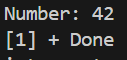
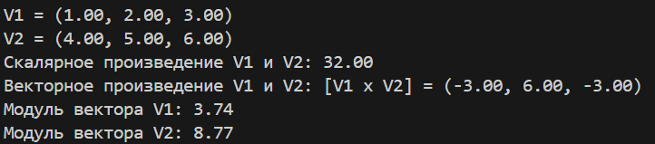
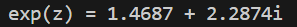

# Лабораторная работа №3 - Указатели, арифметика указателей.
## Задача 1.
Создать некоторую структуру с указателем на некоторую функцию в качестве поля. Вызвать эту функцию через имя переменной этой структуры и поле указателя на функцию.
### Мат. модель:
Отсутствует.
### Список идентификаторов:
|Имя|Тип|Смысл|
|---|---|---|
|func_ptrtypedef|Тип указателя на функцию, принимающую int и возвращающую void|
|MyStruct|struct|Структура, содержащая указатель на функцию|
|function|член struct (func_ptr)|Указатель на функцию внутри структуры MyStruct|
|my_instance|MyStruct|Переменная-экземпляр структуры MyStruct|
|x|int|Параметр функции print_number - число для печати|
### Код:
```c

#include <stdio.h>

// Объявляем тип для указателя на функцию
typedef void (*func_ptr)(int);
// Структура с указателем на функцию
struct MyStruct 
{
    func_ptr function;  // Указатель на функцию, принимающую int и возвращающую void
};
// Пример функции, которую мы будем вызывать
void print_number(int x) 
{
    printf("Number: %d\n", x);
}
int main() 
{
    // Создаем экземпляр структуры
    struct MyStruct my_instance;
    // Присваиваем указателю на функцию адрес функции print_number
    my_instance.function = print_number; 
    // Вызываем функцию через указатель в структуре
    my_instance.function(42);  // Выведет: "Number: 42"
    return 0;
}
```
### Результат:


## Задача 2.
Создать структуру для вектора в 3-х мерном пространстве. Реализовать и использховать в своей программе следующие операции над векторами:
• скалярное умножение векторов;
• векторное произведение;
• модуль вектора;
• распечатка вектора в консоли.
В структуре вектора указать имя вектора в качестве отдельного поля этой структуры.
### Мат. модель:
Отсутствует.
### Список идентификаторов:
|Имя|Тип|Смысл|
|---|---|---|
|Vector3D|struct|Структура, представляющая вектор в 3D-пространстве.|
|name|char[20]|Имя вектора (строка до 20 символов).|
|x|double|Координата вектора в 3D-пространстве.|
|y|double|Координата вектора в 3D-пространстве.|
|z|double|Координата вектора в 3D-пространстве.|
|result|Vector3D|Временная переменная для хранения результата векторного произведения.|
|v1|Vector3D|Экземпляр вектора в функции main.|
|v2|Vector3D|Экземпляр вектора в функции main.|
|dot|double|Переменная для хранения скалярного произведения векторов.|
|cross|Vector3D|Переменная для хранения векторного произведения векторов.|
### Код:
```c
#include <stdio.h>
#include <math.h>
#include <string.h>

// Структура для вектора в 3D пространстве
typedef struct 
{
    char name[20];  // Имя вектора
    double x, y, z; // Координаты
} Vector3D;
// Скалярное произведение векторов
double dotProduct(Vector3D a, Vector3D b) 
{
    return a.x * b.x + a.y * b.y + a.z * b.z;
}
// Векторное произведение векторов
Vector3D crossProduct(Vector3D a, Vector3D b) 
{
    Vector3D result;
    snprintf(result.name, sizeof(result.name), "[%s x %s]", a.name, b.name);
    result.x = a.y * b.z - a.z * b.y;
    result.y = a.z * b.x - a.x * b.z;
    result.z = a.x * b.y - a.y * b.x;
    return result;
}
// Модуль (длина) вектора
double magnitude(Vector3D v) 
{
    return sqrt(v.x * v.x + v.y * v.y + v.z * v.z);
}
// Печать вектора в консоли
void printVector(Vector3D v) 
{
    printf("%s = (%.2f, %.2f, %.2f)\n", v.name, v.x, v.y, v.z);
}
int main() 
{
    // Создаем два вектора
    Vector3D v1 = {"V1", 1.0, 2.0, 3.0};
    Vector3D v2 = {"V2", 4.0, 5.0, 6.0};
    // Печатаем векторы
    printVector(v1);
    printVector(v2);
    // Вычисляем скалярное произведение
    double dot = dotProduct(v1, v2);
    printf("Скалярное произведение %s и %s: %.2f\n", v1.name, v2.name, dot);
    // Вычисляем векторное произведение
    Vector3D cross = crossProduct(v1, v2);
    printf("Векторное произведение %s и %s: ", v1.name, v2.name);
    printVector(cross);
    // Вычисляем модули векторов
    printf("Модуль вектора %s: %.2f\n", v1.name, magnitude(v1));
    printf("Модуль вектора %s: %.2f\n", v2.name, magnitude(v2));
    return 0;
}
```
### Результат:


## Задача 3.
Вычислить, используя структуру комплексного числа, комплексную экспоненту exp(z) некоторого z ∈ C:
### Мат. модель:
Отсутствует.
### Список идентификаторов:
|Имя|Тип|Смысл|
|---|---|---|
|real|double (поле)|Вещественная часть комплексного числа|
|imag|double (поле)|Мнимая часть комплексного числа|
|z|Complex (переменная)|Входное комплексное число для функции complex_exp|
|exp_real|double|Значение экспоненты вещественной части (e^z.real)|
|result|Complex|Результат вычисления экспоненты комплексного числа|
|exp_z|Complex|Результат вычисления complex_exp(z)|

### Код:
```c
#include <stdio.h>
#include <math.h>
typedef struct 
{
    double real;
    double imag;
} Complex;

Complex complex_exp(Complex z) 
{
    double exp_real = exp(z.real);
    Complex result = {
        .real = exp_real * cos(z.imag),
        .imag = exp_real * sin(z.imag)
    };
    return result;
}

int main() 
{
    Complex z = {.real = 1.0, .imag = 1.0};
    Complex exp_z = complex_exp(z);
    printf("exp(z) = %.4f + %.4fi\n", exp_z.real, exp_z.imag);
    return 0;
}
```
### Результат:


## Задача 4.
Используя так называемые "битовые" поля в структуре C, создать экономную структуру в оперативной памяти для заполнения даты некоторого события, например даты рождения человека. 
### Мат. модель:
Отсутствует.
### Список идентификаторов:
|Имя|Тип|Смысл|
|---|---|---|
Date|struct|Структура для хранения даты с использованием битовых полей|
day|unsigned int|Битное поле (5 бит) для хранения дня месяца (диапазон 0-31)|
month|unsigned int|Битное поле (4 бита) для хранения месяца (диапазон 0-15)|
year|unsigned int|Битное поле (12 бит) для хранения года (диапазон 0-4095)|
birthday|struct Date|Переменная типа Date, инициализированная датой 13.12.2005|
sizeof|оператор|Оператор, возвращающий размер объекта в байтах|
### Код:
```c
#include <stdio.h>
struct Date 
{
    unsigned int day   : 5;   // 5 бит (0-31) достаточно для дня
    unsigned int month : 4;   // 4 бита (0-15) достаточно для месяца
    unsigned int year  : 12;  // 12 бит (0-4095) достаточно для года (2005 входит)
};

int main() 
{
    struct Date birthday = {13, 12, 2005};
    printf("My birthday: %u.%u.%u\n", birthday.day, birthday.month, birthday.year);
    printf("Size of structure: %zu bait\n", sizeof(birthday));
    return 0;
}
```
### Результат:


## Задача 5.
Реализовать в виде структур двунаправленный связный список и совершить отдельно его обход в прямом и обратном направлениях с распечаткой значений каждого элемента списка.
### Мат. модель:
Отсутствует.
### Список идентификаторов:
|Имя|Тип|Смысл|
|---|---|---|
|Node|struct|Структура элемента двусвязного списка|
|data|int|Поле структуры Node, хранит целочисленное значение элемента списка|
|prev|struct Node*|Указатель на предыдущий элемент списка|
|next|struct Node*|Указатель на следующий элемент списка|
|newNode|struct Node*|Временный указатель на новый элемент списка|
|head|struct Node**|Указатель на указатель головы списка (двойной указатель)|
|last|struct Node*|Временный указатель для нахождения последнего элемента списка|
|freeList|void (struct Node*)|Функция освобождения памяти, занятой списком|
|temp|struct Node*	Временный|указатель для безопасного удаления элемента списка|
|head (в main)|struct Node*|Указатель на голову списка (основная переменная списка)|

### Код:
```c
#include <stdio.h>
#include <stdlib.h>
// Структура элемента списка
struct Node 
{
    int data;           
    struct Node* prev;  
    struct Node* next;  
};
// Функция для создания нового элемента
struct Node* createNode(int data) 
{
    struct Node* newNode = (struct Node*)malloc(sizeof(struct Node));
    if (newNode == NULL) {
        printf("memory error!\n");
        exit(1);
    }
    newNode->data = data;
    newNode->prev = NULL;
    newNode->next = NULL;
    return newNode;
}
// Функция для добавления элемента в конец списка
void append(struct Node** head, int data) 
{
    struct Node* newNode = createNode(data);
    if (*head == NULL) 
    {
        *head = newNode;
        return;
    }
    struct Node* last = *head;
    while (last->next != NULL) 
    {
        last = last->next;
    }
    last->next = newNode;
    newNode->prev = last;
}
// Функция для печати списка в прямом направлении
void printForward(struct Node* head) 
{
    while (head != NULL) 
    {
        printf("%d ", head->data);
        head = head->next;
    }
    printf("\n");
}
// Функция для печати списка в обратном направлении
void printBackward(struct Node* head) 
{
    if (head == NULL) return;
    while (head->next != NULL) 
    {
        head = head->next;
    }
    while (head != NULL) 
    {
        printf("%d ", head->data);
        head = head->prev;
    }
    printf("\n");
}
// Функция для освобождения памяти
void freeList(struct Node* head) 
{
    struct Node* temp;
    while (head != NULL) 
    {
        temp = head;
        head = head->next;
        free(temp);
    }
}

int main() 
{
    struct Node* head = NULL;
    // Добавляем элементы в список
    append(&head, 10);
    append(&head, 20);
    append(&head, 30);
    append(&head, 40);
    append(&head, 50);
    // Печатаем список в прямом и обратном направлениях
    printForward(head);
    printBackward(head);
    // Освобождаем память
    freeList(head);
    return 0;
}
```
### Результат:


## Задача 2.1.
Напишите программу, которая использует указатель на некоторое объединение union.
### Мат. модель:
Отсутствует.
### Список идентификаторов:
|Имя|Тип|Смысл|
|---|---|---|
|Data|union|Объединение, позволяющее хранить разные типы данных в одной области памяти|
|i|int|Целочисленное поле объединения|
|f|float|Поле объединения для чисел с плавающей точкой|
|str|char[20]|Символьный массив (строка) в объединении|
|data|union Data|Экземпляр объединения Data|
|ptr|union Data*|Указатель на объединение Data|
### Код:
```c

#include <stdio.h>
#include <string.h>

// Определяем объединение
union Data {
    int i;
    float f;
    char str[20];
};

int main() 
{
    union Data data;        
    union Data *ptr = &data; 
    // Работаем с объединением через указатель
    ptr->i = 10;
    printf("data.i through the pointer: %d\n", ptr->i);
    ptr->f = 220.5;
    printf("data.f through the pointer: %.2f\n", ptr->f);
    strcpy(ptr->str, "Hello, Union!");
    printf("data.str through the pointer: %s\n", ptr->str);
    // Демонстрация особенностей union (перезапись значений)
    printf("\nAfter writing the line:\n");
    printf("data.i: %d (мусор)\n", ptr->i);
    printf("data.f: %.2f (мусор)\n", ptr->f);
    printf("data.str: %s\n", ptr->str);
    return 0;
}
```
### Результат:


## Задача 2.2.
Напишите программу, которая использует union для побайтовой распечатки типа unsigned long.
### Мат. модель:
Отсутствует.
### Список идентификаторов:
|Имя|Тип|Смысл|
|---|---|---|
|ByteView|union|Объединение, позволяющее обращаться к числу как к целому или массиву байтов|
|number|unsigned long|Целое число типа unsigned long|
|bytes|unsigned char[]|Массив байтов, представляющих число в памяти (размер = sizeof(unsigned long))|
|viewer|union ByteView|Переменная типа ByteView, используемая для анализа числа в памяти|
|i|size_t|Счётчик цикла для перебора байтов числа|
### Код:
```c
#include <stdio.h>
// Объединение для доступа к байтам unsigned long
union ByteView
{
    unsigned long number;  // Целое число
    unsigned char bytes[sizeof(unsigned long)];  // Массив байтов
};

int main()
{
    union ByteView viewer;
    viewer.number = 0x12345678ABCDEF00;  // Пример числа
    printf("(unsigned long): %lu\n", viewer.number);
    printf("0x%lX\n", viewer.number);
    printf("unsigned long: %zu bait(а)\n\n", sizeof(unsigned long));
    printf("(little-endian order):\n");
    for (size_t i = 0; i < sizeof(unsigned long); i++)
    {
        printf("bait [%zu]: 0x%02X\n", i, viewer.bytes[i]);
    }
    return 0;
}
```
### Результат:


## Задача 2.3.
Создайте перечислимый тип данных (enum) для семи дней недели и распечатайте на экране его значения, как целые числа
### Мат. модель:
Отсутствует.
### Список идентификаторов:
|Имя|Тип|Смысл|
|---|---|---|
|DaysOfWeek|enum|Перечисление, представляющее дни недели (значения по умолчанию 0–6)|
|MONDAY|int|Понедельник (значение = 0)|
|TUESDAY|int|Вторник (значение = 1)|
|WEDNESDAY|int|Среда (значение = 2)|
|THURSDAY|int|Четверг (значение = 3)|
|FRIDAY|int|Пятница (значение = 4)|
|SATURDAY|int|Суббота (значение = 5)|
|SUNDAY|int|Воскресенье (значение = 6)|

### Код:
```c
#include <stdio.h>
// Создаем перечислимый тип для дней недели
enum DaysOfWeek 
{
    MONDAY,    // 0
    TUESDAY,   // 1
    WEDNESDAY, // 2
    THURSDAY,  // 3
    FRIDAY,    // 4
    SATURDAY,  // 5
    SUNDAY     // 6
};

int main() 
{
    // Выводим числовые значения дней недели
    printf("days:\n");
    printf("Monday: %d\n", MONDAY);
    printf("Tuesday: %d\n", TUESDAY);
    printf("Wednesday: %d\n", WEDNESDAY);
    printf("Thursday: %d\n", THURSDAY);
    printf("Friday: %d\n", FRIDAY);
    printf("Saturday: %d\n", SATURDAY);
    printf("Sunday: %d\n", SUNDAY);
    return 0;
}
```
### Результат:


## Задача 2.4.
Создайте так называемое размеченное объединение union, которое заключено в виде поля структуры struct вместе с ещё одним полем, которое является перечислением enum и служит индикатором того, что именно на текущий момент хранится в таком вложенном объединении. Создать и заполнить динамический массив таких структур с объединениями внутри, заполняя вспомогательное поле перечисления enum для сохранения информации о хранимом в каждом размеченном объединении типе данных. Реализовать распечатку данных массива таких структур в консоль.
### Мат. модель:
Отсутствует.
### Список идентификаторов:
|Имя|Тип|Смысл|
|---|---|---|
|DataType|enum|Перечисление для указания типа данных в объединении|
|INT_TYPE|enum|Константа, обозначающая целочисленный тип данных|
|FLOAT_TYPE|enum|Константа, обозначающая тип данных с плавающей точкой|
|STR_TYPE|enum|Константа, обозначающая строковый тип данных|
|DataUnion|union|Объединение для хранения разных типов данных в одной области памяти|
|int_data|int|Поле для хранения целочисленного значения|
|float_data|float|Поле для хранения значения с плавающей точкой|
|str_data|char[32]|Поле для хранения строки (максимум 31 символ + '\0')|
|TaggedData|struct|Структура, содержащая метку типа и объединение данных|
|type|DataType|Поле-метка, указывающее тип данных в объединении|
|data|DataUnion|Поле-объединение для хранения данных|
|ARRAY_SIZE|const int|Константа, определяющая размер массива|
|array|TaggedData*|Указатель на динамический массив структур TaggedData|
|i|int|Счетчик цикла|

### Код:
```c
#include <stdio.h>
#include <stdlib.h>
#include <string.h>

// Перечисление для указания типа данных в объединении
typedef enum {
    INT_TYPE,
    FLOAT_TYPE,
    STR_TYPE
} DataType;

// Размеченное объединение
typedef union {
    int int_data;
    float float_data;
    char str_data[32];
} DataUnion;

// Структура, содержащая объединение и метку типа
typedef struct {
    DataType type;  
    DataUnion data; 
} TaggedData;

// Функция для печати одной структуры
void print_tagged_data(const TaggedData* td) 
{
    switch (td->type) 
    {
        case INT_TYPE:
            printf("Type: INT\tValue: %d\n", td->data.int_data);
            break;
        case FLOAT_TYPE:
            printf("Type: FLOAT\tValue: %.2f\n", td->data.float_data);
            break;
        case STR_TYPE:
            printf("Type: STRING\tValue: %s\n", td->data.str_data);
            break;
        default:
            printf("Unknown type!\n");
    }
}

int main() 
{
    const int ARRAY_SIZE = 3;
    
    // Создаем динамический массив структур
    TaggedData* array = (TaggedData*)malloc(ARRAY_SIZE * sizeof(TaggedData));
    
    if (!array) 
    {
        perror("Memory allocation failed");
        return 1;
    }
    // Заполняем массив разными типами данных
    array[0].type = INT_TYPE;
    array[0].data.int_data = 42;
    array[1].type = FLOAT_TYPE;
    array[1].data.float_data = 3.14159f;
    array[2].type = STR_TYPE;
    strncpy(array[2].data.str_data, "Hello, Tagged Union!", sizeof(array[2].data.str_data));
    // Печатаем содержимое массива
    printf("Dynamic array of tagged unions:\n");
    for (int i = 0; i < ARRAY_SIZE; i++) 
    {
        printf("[%d] ", i);
        print_tagged_data(&array[i]);
    }
    // Освобождаем память
    free(array);
    return 0;
}
```
### Результат:

