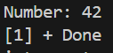
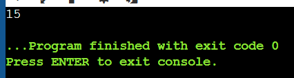
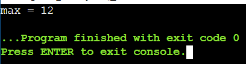
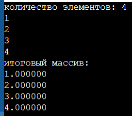
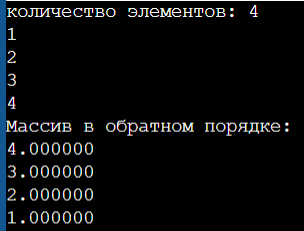
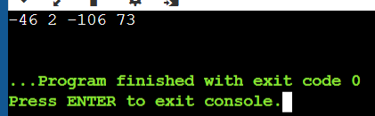
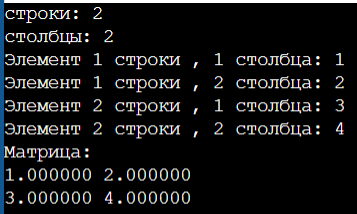

# Лабораторная работа №2 - Указатели, арифметика указателей.
## Задача 1.
Внутри функции int main(void) { /*...*/ } определите указатель double ***pointer = NULL;. Инициализируйте этот указатель адресом другого указателя типа double **, который указывает на переменную double *, которая указывает на double. Используйте pointer для записи и чтения значения 2.0 в сегмент оперативной памяти для double.
### Мат модель:
Отсутствует.
### Список идентификаторов:
|Имя|Тип|Смысл|
|---|---|---|
|p1|double*|Указатель на выделенную память размера double в памяти|
|p2|double**|Указатель на выделенную память размера double* в памяти|
|p3|double***|Указатель на выделенную память размера double** в памяти|

### Код:
```c
#include <stdio.h>
#include <stdlib.h>
int main() 
{
    double* p1 = malloc(sizeof(double));
    double** p2 = malloc(sizeof(double*));
    double*** p3 = malloc(sizeof(double**));
    *p2 = p1;
    *p3 = p2;
    ***p3 = 2.0;
    printf("%lf\n", *p1);
    free(p1);
    free(p2);
    free(p3);
    return 0;
}
```
### Результат:



## Задача 2.
Напишите программу, которая складывает два числа с использованием указателей на эти числа.
### Мат модель:
c = a + b
### Список идентификаторов:
|Имя|Тип|Смысл|
|---|---|---|
|a|int|Первое число|
|b|int|Второе число|
|A|int*|Указатель на a|
|B|int*|Указатель на b|
|c|int|Результат|

### Код:
```c
#include <stdio.h>
#include <stdlib.h>

int main(void)
{
    int a, b, *A, *B, c;
    A = &a;
    B = &b;
    a = 10;
    b = 5;
    c = *A + *B;
    printf ("%d", c);
    return 0;
}
```
### Результат:



## Задача 3.
Напишите программу, которая находит максимальное число из двух чисел, используя указатели на эти числа.
### Мат модель:
Отсутствует.
### Список идентификаторов:
|Имя|Тип|Смысл|
|---|---|---|
|*p1|int|Указатель на первое число|
|*p2|int|Указатель на второе число|
|**p3|int*|Указатель на первое число|
|**p4|int*|Указатель на второе число|

### Код:
```c
#include <stdio.h>
#include <stdlib.h>

int main(void) 
{
    int **p3 = NULL;
    int **p4 = NULL;
    int *p2 = malloc(sizeof(int));
    int *p1 = malloc(sizeof(int));
    p3 = &p1;
    p4 = &p2;
    **p3 = 12;
    **p4 = 10;
    if (*p1 > *p2)
    {
        printf ("max = %d",*p1);
    }
    else
    {
    printf ("max = %d",*p2);
    }
    return 0;
}
```
### Результат:



## Задача 4.
Напишите программу, которая создаёт одномерный динамический массив из чисел с плавающей точкой двойной точности, заполняет его значениями с клавиатуры и распечатывает все элементы этого массива, используя арифметику указателей (оператор +), а не оператор доступа к элементу массива [].
### Мат модель:
Отсутствует.
### Список идентификаторов:
|Имя|Тип|Смысл|
|---|---|---|
|s|int|Размер массива|
|a|double*|Указатель на выделенную память под массив|
|i|int|Параметр цикла|

### Код:
```c
#include <stdio.h>
#include <stdlib.h>
int main() 
{
    int s;
    printf("количество элементов: ");
    scanf("%d", &s);
    double* a = (double*) malloc(s * sizeof(double));
    for (int i = 0; i < s; ++i) 
    {
        scanf("%lf", a + i * sizeof(double));
    }
    printf("итоговый массив:\n");
    for (int i = 0; i < s; ++i) 
    {
        printf("%lf\n", *(a + i * sizeof(double)));
    }
    free(a);
    return 0;
}
```
### Результат:


## Задача 5.
Выведите элементы динамического массива целых чисел в обратном порядке, используя указатель и операцию декремента (--).
### Мат модель:
Отсутствует.
### Список идентификаторов:
|Имя|Тип|Смысл|
|---|---|---|
|size|size_t|Размер выделяемого массива|
|array|double*|Указатель на выделенную память под массив.|
|parray|double*|Второй указатель на выделенную память под массив.|
|i|int|Параметр цикла|
### Код:
```c
#include <stdio.h>
#include <stdlib.h>
int main() 
{
    size_t size;
    printf("количество элементов: ");
    scanf("%zu", &size);
    double* array = (double*) malloc(size * sizeof(double));
    double* parray = array;
    for (size_t i = 0; i < size; ++i) 
    {
        printf("%zu-й элемент: ", i + 1);
        scanf("%lf", parray);
        ++parray;
    }
    printf("Массив в обратном порядке:\n");
    for (size_t i = 0; i < size; ++i) 
    {
        --parray;
        printf("%lf\n", *parray);
    }
    free(array);
    return 0;
}
```
### Результат:


## Задача 6.
Определите переменную целого типа int a = 1234567890; и выведите побайтово её содержимое на экран, используя указатель char *.
### Мат модель:
Отсутствует.
### Список идентификаторов:
|Имя|Тип|Смысл|
|---|---|---|
|a|int|Вводимое значение|
|pa|char*|Указатель типа char на число a|
|i|int|Параметр цикла|
### Код:
```c
#include <stdio.h>
#include <stdlib.h>
int main() 
{
    int a = 1234567890;
    char* pa = (char*) &a;
    for (size_t i = 0; i < sizeof(a); ++i) 
    {
        printf("%d ", pa[i]);
    }
    printf("\n");
    return 0;
}
```
### Результат:


## Задача 6.
Выделите память под двумерный динамический массив, используя массив указателей на строки (см. лекции), и затем корректно освободите оперативную память.
### Мат модель:
Отсутствует.
### Список идентификаторов:
|Имя|Тип|Смысл|
|---|---|---|
|rows|size_t|Количество строк|
|cols|size_t|Количество столбцов|
|array|double**|Указатель на выделенную память под double|
|row|size_t|Параметр цикла строк|
|col|size_t|Параметр цикла столбцов|

### Код:
```c
#include <stdio.h>
#include <stdlib.h>
int main() 
{
    size_t rows, cols;
    printf("строки: ");
    scanf("%zu", &rows);
    printf("столбцы: ");
    scanf("%zu", &cols);
    double **array = malloc(rows * sizeof(double*));
    for (size_t row = 0; row < rows; ++row) 
    {
        array[row] = (double*) malloc(cols * sizeof(double));
    }
    for (size_t row = 0; row < rows; ++row) 
    {
        for (size_t col = 0; col < cols; ++col) 
        {
            printf("Элемент %zu строки , %zu столбца: ", row + 1, col + 1);
            scanf("%lf", &array[row][col]);
        }
    }
    printf("Матрица:\n");
    for (size_t row = 0; row < rows; ++row) 
    {
    for (size_t col = 0; col < cols; ++col) 
        {
            printf("%lf ", array[row][col]);
        }
        printf("\n");
    }
    for (size_t row = 0; row < rows; +row) 
    {
        free(array[row]);
    }
    free(array);
    return 0;
}
```
### Результат:

